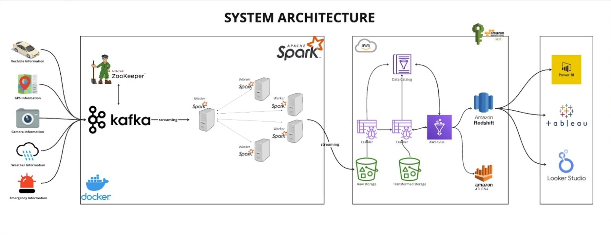
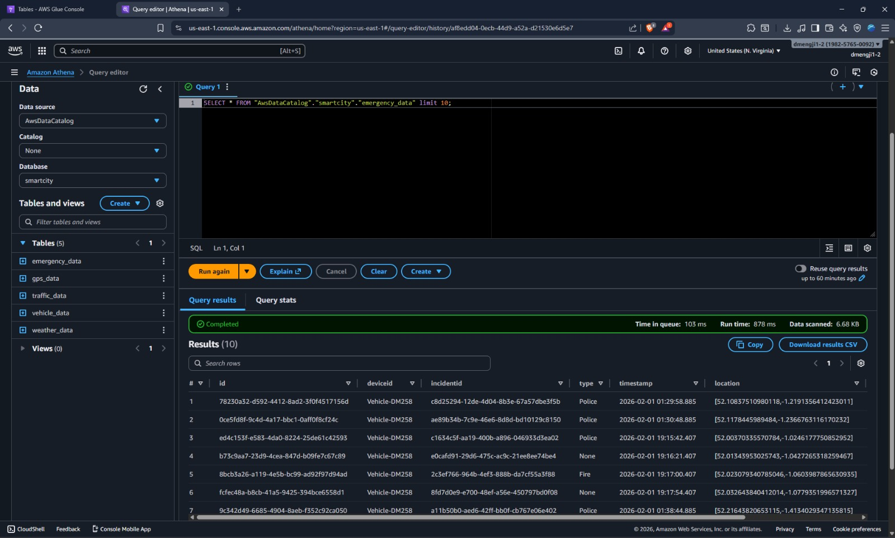

# 🚦 Smart City Real-Time Data Streaming & Analytics Platform

A **cloud-native, real-time smart city analytics system** built using **Apache Kafka, Apache Spark, Docker, and AWS analytics services** to ingest, process, store, and analyze high-velocity urban data streams such as **vehicle telemetry, GPS, traffic, weather, and emergency events**.

This project demonstrates **end-to-end data engineering**, from real-time ingestion to **serverless analytics and BI visualization**, designed at **production-scale architecture standards**.

---

## 📌 Problem Statement

Modern smart cities generate massive volumes of heterogeneous, real-time data from multiple sources:

- 🚗 Vehicles  
- 📍 GPS sensors  
- 📷 Traffic cameras  
- 🌦️ Weather services  
- 🚨 Emergency systems  

The challenge is to:
- Ingest this data **reliably and in real time**
- Process and transform it at scale
- Store it efficiently for analytics
- Enable **fast querying and visualization** for decision-making systems

---

## 🧠 Solution Overview

This project implements a **distributed streaming data pipeline** that:

1. Ingests real-time data using **Apache Kafka**
2. Processes streams using **Apache Spark Structured Streaming**
3. Stores raw and transformed data in **Amazon S3**
4. Catalogs data using **AWS Glue Data Catalog**
5. Enables ad-hoc SQL analytics via **Amazon Athena**
6. Supports BI dashboards using **Power BI, Tableau, and Looker Studio**

---

## 🏗️ System Architecture

> High-level distributed architecture of the platform



---

## 🔧 Architecture Components

| Layer | Technology | Purpose |
|------|-----------|---------|
| Ingestion | Apache Kafka, ZooKeeper | High-throughput real-time streaming |
| Processing | Apache Spark (Cluster Mode) | Distributed stream processing |
| Containerization | Docker, Docker Compose | Local orchestration & reproducibility |
| Storage | Amazon S3 | Raw & transformed data lake |
| Metadata | AWS Glue Data Catalog | Schema & table management |
| Query Engine | Amazon Athena | Serverless SQL analytics |
| Visualization | Power BI, Tableau, Looker Studio | Dashboards & insights |
| Security | AWS IAM | Secure access control |

---

## 🔄 End-to-End Data Flow

1. **Data Producers** generate JSON streams for:
   - `vehicle_data`
   - `gps_data`
   - `traffic_data`
   - `weather_data`
   - `emergency_data`

2. **Apache Kafka** ingests these events into dedicated topics.

3. **Apache Spark Structured Streaming**:
   - Consumes Kafka topics
   - Parses and validates records
   - Applies transformations and schema enforcement
   - Writes structured outputs to **Amazon S3**

4. **AWS Glue Crawlers** automatically infer schemas and populate the Glue Data Catalog.

5. **Amazon Athena** queries data directly from S3 using SQL.

6. **BI Tools** connect to Athena / Redshift for visualization.

---

## 🧪 Analytics (Amazon Athena)

> Querying real streaming data using serverless SQL



```sql
SELECT *
FROM "AwsDataCatalog"."smartcity"."emergency_data"
LIMIT 10;
```
---


---

## 📁 Project Structure
```bash
.
├── docker-compose.yml        # Kafka, Spark, Zookeeper services
├── requirements.txt          # Python dependencies
├── config.py                 # Kafka & AWS configuration
├── main.py                   # Kafka producer logic
├── spark-city.py             # Spark streaming job
├── commands.txt              # Useful CLI commands
├── Architecture.jpeg         # Architecture diagram
├── Athena-Query-Run.jpeg     # Athena query proof
└── README.md
```

## ⚙️ Tech Stack

### Streaming & Processing
- Apache Kafka  
- Apache Spark (Structured Streaming)  
- ZooKeeper  

### Cloud & Analytics
- Amazon S3  
- AWS Glue  
- Amazon Athena  
- Amazon Redshift *(optional downstream)*  

### DevOps
- Docker  
- Docker Compose  

### BI & Visualization
- Power BI  
- Tableau  
- Looker Studio  


---

## 🚀 How to Run Locally
```bash
# Update AWS configuration values in `config.py`.
configuration = {
    "AWS_ACCESS_KEY": "<your-aws-access-key>",
    "AWS_SECRET_KEY": "<your-aws-secret-key>",
    "AWS_REGION": "<your-aws-region>
}
```
```bash
# Start Kafka, Spark, and ZooKeeper
docker-compose up
```
```bash
# Run Kafka data producers
python main.py
```
```bash
# Submit Spark streaming job
spark-submit spark-city.py
```
---
## ⭐ Key Engineering Highlights

- Event-driven architecture using Apache Kafka  
- Scalable stream processing with Apache Spark  
- Schema-on-read analytics using Amazon Athena  
- Serverless S3-based data lake architecture  
- IAM-secured cloud resources  
- Designed for high throughput and fault tolerance  

---

## 🎯 Why This Project Matters

This system closely resembles **real-world smart city and IoT data platforms**, commonly used for:

- Traffic monitoring and optimization  
- Emergency response analytics  
- Urban mobility insights  
- City-scale sensor data processing  

It demonstrates strong proficiency in:

- Distributed systems  
- Data engineering  
- Cloud-native analytics  
- Streaming architectures  
- Production-ready system design  

---

## 🔮 Future Enhancements

- Real-time dashboards using Amazon QuickSight  
- Machine learning–based anomaly detection on streaming data  
- Alerting and notification system for emergency events  
- Data quality checks and monitoring  
- Infrastructure as Code (IaC) using Terraform  
--- 
---
## 👩‍💻 About Me

Hi, I’m **Dyuti**, an aspiring Data Analyst passionate about turning data into insights and building real-world analytics projects.

🔗 **GitHub:** https://github.com/DyutiM25  
---
